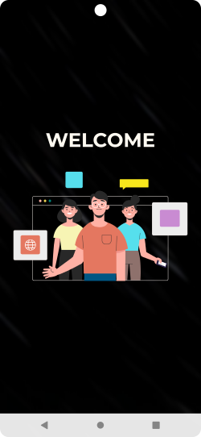
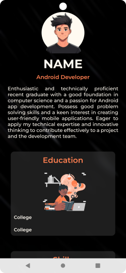
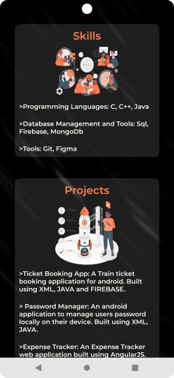
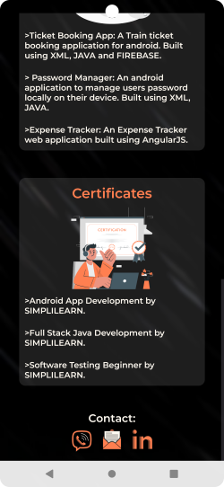

# Personal Portfolio Android App

## Overview
A simple personal portfolio Android application that showcases profile, education, skills, projects, certificates and contact information sections.  

## Features
- Introduction
- Skills and technologies overview
- Projects
- Contact information and social links
- Clean and responsive UI
- Smooth navigation

## Tech Stack
- **Language:** Java
- **Platform:** Android
- **UI:** XML
- **Tools:** Lottie, BlurView, Android Studio, Git, GitHub

## Screenshots

<!--

-->

| | 
| | 
| | 
| | 